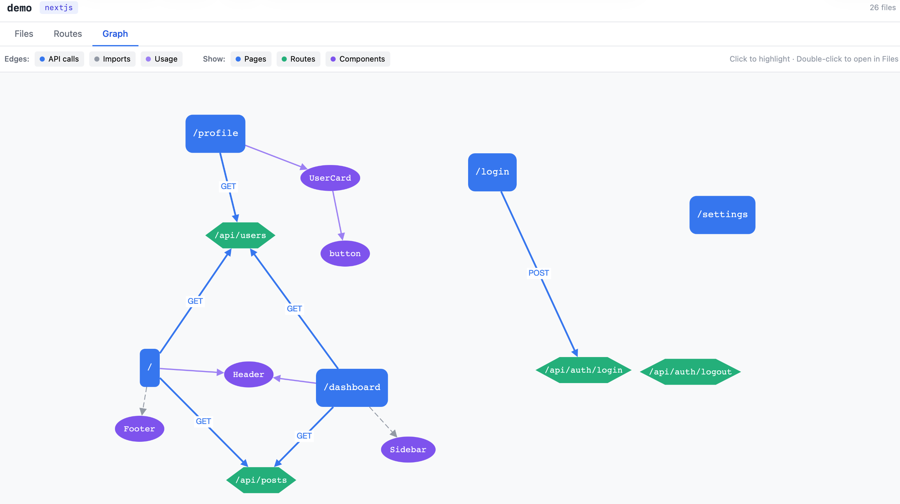

# forge

A meta-CLI for scaffolding projects from blueprints and understanding them as they grow. One command produces a working project. Another adds new pieces to it. A third opens an interactive dashboard showing how the pieces wire together. Built in Go, ships as a single static binary.



## Why forge

When you start a new project — a hackathon prototype, a side project, a service — you spend hours wiring up the same foundation every time. Next.js + Tailwind + shadcn + auth + a database. Or Go + cobra + a logger. Or whatever your stack is. forge codifies that foundation as a **blueprint** — a template that knows your conventions — and gets you to "ready to write the actual code" in seconds.

Once your project exists, forge can extend it. Need a new API route? `forge add api-route users`. Need a new page? `forge add page dashboard`. The extensions know your project structure, follow your conventions, and update your project's metadata as they go.

Then, as your project grows — especially when AI tools like Claude Code and Cursor are writing parts of it — you need to verify the wiring. Did that new component get used? Does that fetch call hit a real route? Is anything orphaned? `forge visualize` analyzes your project and shows you the answers in a real-time dashboard. Edit a file, see the graph update.

## Quick demo

```bash
# Scaffold a Next.js + Tailwind + shadcn app
$ forge new hackathon-app my-app --yes
Created hackathon-app project at ./my-app
13 files written
Knowledge graph written to .understand-anything/knowledge-graph.json
Project marker written to .forge/project.json
Running hook (1/2): Initialize git
✓ Initialize git
Running hook (2/2): Install dependencies
✓ Install dependencies

# Add extensions from the project directory
$ cd my-app
$ forge add api-route users
Added api-route to my-app
1 file written
  app/api/users/route.ts
Knowledge graph updated: 1 nodes added, 1 edges added
Project marker updated

$ forge add page dashboard
Added page to my-app
1 file written
  app/dashboard/page.tsx
Knowledge graph updated: 1 nodes added, 1 edges added
Project marker updated

$ forge add component UserCard
Added component to my-app
1 file written
  components/UserCard.tsx
Knowledge graph updated: 1 nodes added, 0 edges added
Project marker updated
```

## Quick demo — Analyze your project

Once you have a project (any Next.js project, not just forge-scaffolded), you can see its structure:

```bash
$ cd my-app
$ forge visualize
Analyzing my-app...
Analyzed 16 files in 10ms
Analysis written to .forge/analysis.json
Dashboard running at http://localhost:5050
Press Ctrl+C to stop.
```

This opens an interactive dashboard with three views:

- **Files** — every file in your project with imports, exports, declarations, and API calls
- **Routes** — frontend pages connected to backend API routes, with detected HTTP calls
- **Graph** — a force-directed visualization of the whole structure

The dashboard updates live as you edit files. When you tell Claude Code to "add a new page that fetches /api/users," you can watch the new connection appear in real time.

## Install

**Quick install (recommended)**

```bash
curl -fsSL https://raw.githubusercontent.com/kanukuntla-R/forge/main/install.sh | bash
```

Installs to `~/.local/bin/forge`. Make sure that's on your PATH.

**Build from source**

Requires Go 1.22+.

```bash
git clone https://github.com/kanukuntla-R/forge
cd forge
make install   # builds and installs to ~/.local/bin/forge
```

## Commands

- `forge new <blueprint> [name]` — scaffold a new project from a blueprint
- `forge add <extension> [args]` — add an extension to an existing project
- `forge analyze [path]` — analyze a project and write `.forge/analysis.json`
- `forge visualize [path]` — open the analysis dashboard with live updates
- `forge list` — list available blueprints (embedded + installed)
- `forge install <git-url>` — install a blueprint from a git repository

All commands support `--help`. Most support `--json` for structured output.

## What forge does

- **Blueprints**: opinionated project templates with variables, conditional features, and post-create hooks
- **Extensions**: layered scaffold operations that add to existing projects
- **Knowledge graphs**: every scaffolded project ships with a graph of its architecture, updated as extensions are applied
- **Interactive prompts**: when run in a terminal, forge walks through unset variables; in CI, it accepts `--var` flags or JSON on stdin
- **Atomic writes**: file operations stage-then-rename, so failed scaffolds don't leave half-written state
- **Embedded + installed blueprints**: ship blueprints inside the binary, install more from any git URL
- **Analysis + dashboard**: static analysis of TypeScript/JavaScript projects with a live-updating dashboard showing files, routes, components, and API connections

## Built-in blueprint

### hackathon-app

A Next.js 14 + Tailwind + shadcn starter, with optional conditional features:

- AI integration (`--var with_ai=true`): Anthropic SDK setup with a starter `/api/ai` route
- Dark mode (`--var with_dark_mode=true`): next-themes integration with a toggle component
- Authentication + database (`--var with_auth=true with_database=true`): Supabase auth flow with email/password and a configured database client

Comes with three extensions:

- `api-route` — adds a new Next.js API route
- `page` — adds a new page under `app/`
- `component` — adds a new React component under `components/`

## Writing your own blueprint

Blueprints are directories with a manifest, a template tree, and optional extensions. See [`docs/forge-design.md`](docs/forge-design.md) for the full design and authoring guide. Once your blueprint repo is on GitHub, anyone can install it with `forge install <your-git-url>`.

## Status

v0.2 ships scaffolding + analysis. The roadmap beyond v0.2 includes:

- **Caching** — content-hash-based caching for faster re-analysis on large projects
- **More framework detectors** — beyond Next.js (Astro, Remix, SvelteKit)
- **More blueprints** — Go CLI starter, Python API starter, others as needs emerge
- **Database as a first-class concept** — pluggable database providers (Supabase, Postgres, libsql, etc.) as installable extensions

See [`docs/forge-design.md`](docs/forge-design.md) and [`docs/forge-analyzer-design.md`](docs/forge-analyzer-design.md) for full design notes. See [`docs/RELEASE_NOTES.md`](docs/RELEASE_NOTES.md) for what shipped in v0.2.

## License

PolyForm Noncommercial 1.0.0. Free to use for non-commercial purposes — personal projects, learning, research, contributions. Commercial use requires a separate license.

## Building forge

```bash
make build      # local build for your platform
make test       # run the test suite
make release    # cross-compile to dist/ for linux/darwin × amd64/arm64
make install    # build and install to ~/.local/bin/
make clean      # remove build artifacts
```
